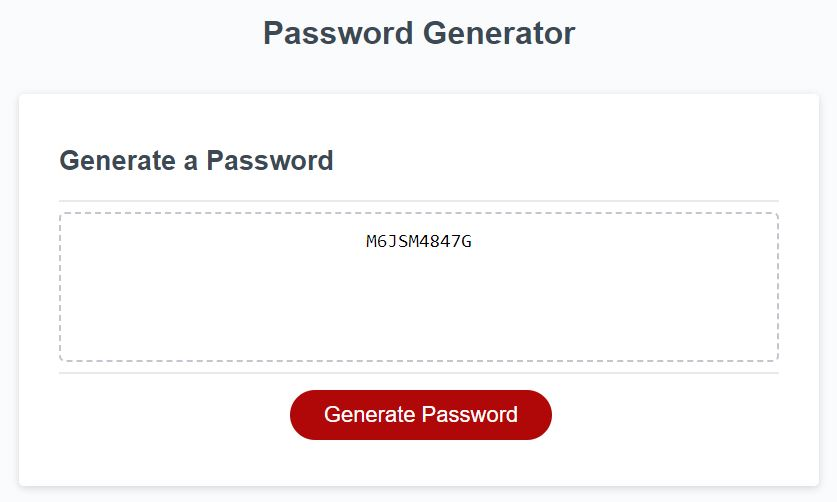
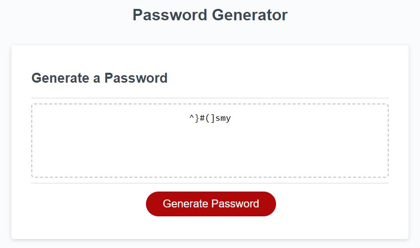
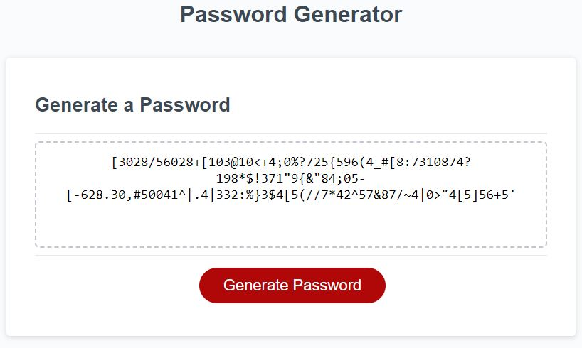
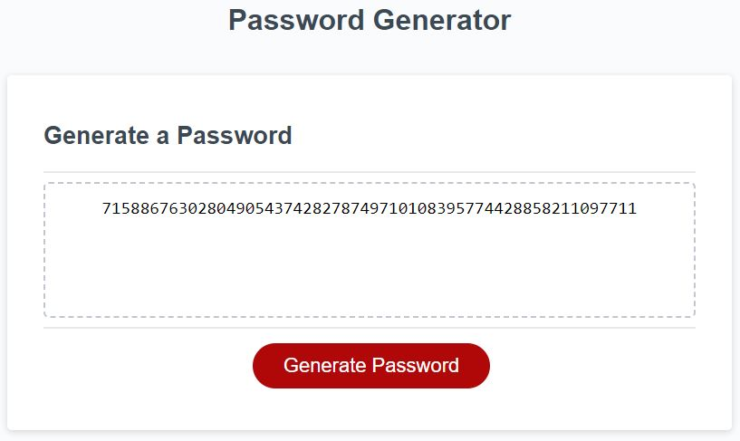

# ubiquitous-octo-tribble
03 Challenge Bootcamp

# Description
In this challenge, it is required to modify the code to a working state, where, by inputting the length of the password and confirming other criteria, the system outputs a password according to the criteria given.

## Acceptance Criteria

```
GIVEN I need a new, secure password
WHEN I click the button to generate a password
THEN I am presented with a series of prompts for password criteria
WHEN prompted for password criteria
THEN I select which criteria to include in the password
WHEN prompted for the length of the password
THEN I choose a length of at least 8 characters and no more than 128 characters
WHEN asked for character types to include in the password
THEN I confirm whether or not to include lowercase, uppercase, numeric, and/or special characters
WHEN I answer each prompt
THEN my input should be validated and at least one character type should be selected
WHEN all prompts are answered
THEN a password is generated that matches the selected criteria
WHEN the password is generated
THEN the password is either displayed in an alert or written to the page
```
# Code Snippets
### JavaScript
Function for valuating the length of the password
It should be at least 8 characters and no more than 128 characters and of course, numeric.
Returns a numeric value for length.
```js
function length_promts(){
  var psw_length = 0;
  do{
  psw_length = window.prompt("Please provide the length for the password\nMinimum:8 - Maximum:128","");
  try {
    psw_length = Number.parseInt(psw_length);
  } catch (error) {
    console.log("error");
  }
}while(psw_length==0 || psw_length<8 || psw_length>128 || !(Number.isInteger(psw_length)));
  return psw_length;
}
```

Function for valuating the criteria for the password
The criteria were the follows:
>
> * Confirmation prompt for lowercase characters
>
> * Confirmation prompt for uppercase characters
>
> * Confirmation prompt for numeric characters
>
> * Confirmation prompt for special characters

Returns a boolean array with a true/false value for each criteria.
```js
function type_promts(){
  var types_char;
  var continue_val = true;
  do{
    window.alert("What types of characters should be included in the key?\nlowercase, uppercase, numeric, and/or special\nAt least one type should be selected!");    
    
    let hasL = window.confirm("should contain lowercase characters?");
    let hasU = window.confirm("should contain uppercase characters?");
    let hasN = window.confirm("should contain numeric characters?");
    let hasS = window.confirm("should contain special characters?");

    types_char = [hasL, hasU, hasN, hasS];

    continue_val= !(hasL || hasU || hasN || hasS); 
    if(continue_val){
      alert("At least one type should be selected");    
    }
  }while(continue_val);
  return types_char;
}
```
Funtion that generates the password:
start with a loop for the length of the password. Then generates a random integer from 0 to 3 that just land on the criteria selected for then evaluate the option in a switch that will add the character to the password and goes for the rest of the loop.
```js
function generatePassword(psw_length,psw_types){
  var passwordgen;
  var aux_password = "";
  for(let i=0;i<psw_length;i++){
    let random;
    do{
      random = Math.floor(Math.random() * 4);

    }while(!psw_types[random]);

    switch(random){
      case 0:
        aux_password = aux_password + lowercaseRandom() + "";
        break;
      
      case 1:
        aux_password = aux_password + uppercaseRandom() + "";
        break;
      
      case 2:
        aux_password = aux_password + numericRandom() + "";
        break;
      
      case 3:
        aux_password = aux_password + specialRandom() + "";
        break;
    }
    
  }  
  passwordgen = aux_password;
  return passwordgen;
}
```
# Screenshots
## Criteria Example 10 character just uppercase and numeric.

## Criteria Example 8 character just lowercase and special.

## Criteria Example 128 character just numeric and special.

## Criteria Example 56 character just numeric.


# Pages Link
Website Link [Github Pages Link](https://santis1001.github.io/ubiquitous-octo-tribble/)
